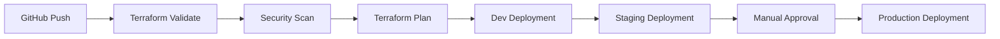

# 🌐 Multi-Environment Azure Infrastructure Setup

<p align="center">
  
</p>

<p align="center">
  
  
  
  
</p>

---

## 📌 Overview

Enterprise-grade **3-Tier Azure Infrastructure** built using Terraform and Azure DevOps.

This project demonstrates how to provision and manage **Development, Staging, and Production environments** using reusable Terraform modules and automated CI/CD workflows.

### Key Objectives

* Multi-Environment Infrastructure
* Infrastructure as Code (IaC)
* Secure Networking
* Automated Deployments
* High Availability Architecture
* Enterprise Cloud Governance

---

## 🏗️ Architecture Diagram

<p align="center">
  
</p>

---

## ✨ Core Components

| Layer                 | Services                                    |
| --------------------- | ------------------------------------------- |
| 🌐 Networking         | VNet, Subnets, NSGs, Private Endpoints      |
| ⚖️ Traffic Management | Application Gateway, Internal Load Balancer |
| 💻 Compute            | Frontend & Backend Virtual Machines         |
| 🔐 Security           | Azure Bastion, Key Vault                    |
| 🗄️ Database          | Azure SQL Server & Database                 |
| 📊 Monitoring         | Azure Monitor, Log Analytics                |
| 🚀 Automation         | Terraform + Azure DevOps                    |

---

## 🌍 Environment Strategy

```text
Development
│
├── Small Compute Resources
├── Rapid Testing
└── Frequent Deployments

Staging
│
├── Production-like Environment
├── Validation & UAT
└── Release Verification

Production
│
├── High Availability
├── Secure Configuration
└── Business Critical Workloads
```

---

## 🔄 CI/CD Pipeline



### Pipeline Features

* Terraform Validation
* Security Scanning (Checkov / tfsec)
* Automated Dev & Staging Deployment
* Production Approval Gates
* Infrastructure Drift Detection

---

## 📂 Repository Structure

```text
.
├── .github/
│   └── workflows/
│
├── modules/
│   ├── networking/
│   ├── compute/
│   ├── database/
│   └── security/
│
├── environments/
│   ├── dev/
│   ├── staging/
│   └── prod/
│
└── README.md
```

---

## 🚀 Deployment Workflow

### Clone Repository

```bash
git clone https://github.com/Pjaisw1103/Multi-Environment-Azure-Infrastructure-Setup.git
cd Multi-Environment-Azure-Infrastructure-Setup
```

### Login to Azure

```bash
az login
```

### Navigate to Environment

```bash
cd environments/dev
```

### Initialize Terraform

```bash
terraform init
```

### Validate Configuration

```bash
terraform validate
```

### Generate Execution Plan

```bash
terraform plan -var-file="dev.tfvars"
```

### Deploy Infrastructure

```bash
terraform apply -var-file="dev.tfvars" -auto-approve
```

---

## 📊 Project Highlights

<p align="center">


</p>

---

## 🎯 Learning Outcomes

* Enterprise Azure Architecture Design
* Terraform Module Development
* Azure Networking & Security
* Azure SQL & Private Endpoints
* CI/CD with Azure DevOps
* Infrastructure Automation

---

## 👩‍💻 Author

**Priya Jaiswal**

Azure Cloud | DevOps | Terraform

<p align="center">
  <a href="https://github.com/Pjaisw1103">
    
  </a>

  <a href="https://linkedin.com/in/priya-jaiswal1103">
    
  </a>
</p>

---

<p align="center">
⭐ If you found this project useful, consider giving it a star.
</p>
